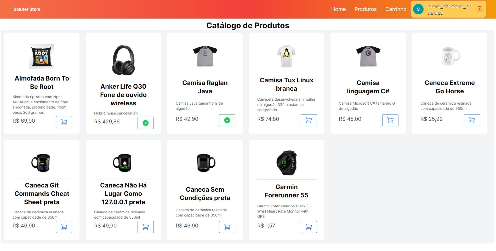
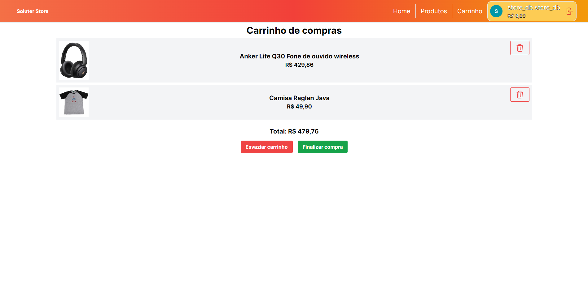

# Soluter Store

Este é o arquivo README para a aplicação front-end do sistema Soluter Store. A aplicação foi desenvolvida utilizando Next.js.

## Instalação

Para instalar e executar a aplicação, siga os passos abaixo:

1. Clone este repositório em sua máquina local.
2. Navegue até o diretório do projeto: `cd soluter-store-web`.
3. Instale as dependências do projeto: `npm install`.
4. Inicie a aplicação: `npm run dev`.

## Funcionalidades

A aplicação Soluter Store possui as seguintes funcionalidades:

- [x] Login de usuários através de Autenticação externa (Google, Microsoft, Github, etc).
- [x] Catálogo de produtos.
- [x] Carrinho de compras.
- [ ] Checkout de compras.
- [ ] Histórico de compras.

## Tecnologias

A aplicação Soluter Store foi desenvolvida utilizando as seguintes tecnologias:

- [Next.js](https://nextjs.org/)
- [React](https://reactjs.org/)
- [TypeScript](https://www.typescriptlang.org/)
- [Tailwind CSS](https://tailwindcss.com/)
- [Next-auth](https://next-auth.js.org/)
- [Zustand](https://zustand-demo.pmnd.rs/)

## Telas

A aplicação Soluter Store possui as seguintes telas:

### Home

### Catálogo de produtos

### Carrinho de compras

## Contribuição

Se você deseja contribuir para este projeto, siga os passos abaixo:

1. Crie uma branch para sua contribuição: `git checkout -b minha-contribuicao`.
2. Faça as alterações desejadas.
3. Faça o commit das suas alterações: `git commit -m "Minha contribuição"`.
4. Faça o push para o repositório remoto: `git push origin minha-contribuicao`.
5. Abra um pull request para revisão.

 
Ícones: https://www.flaticon.com/br/icon-fonts-mas-baixados